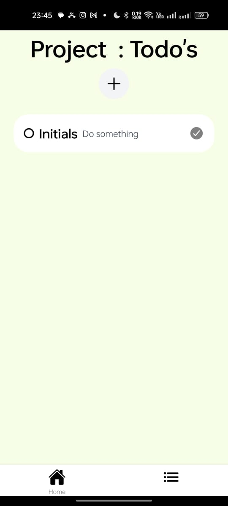
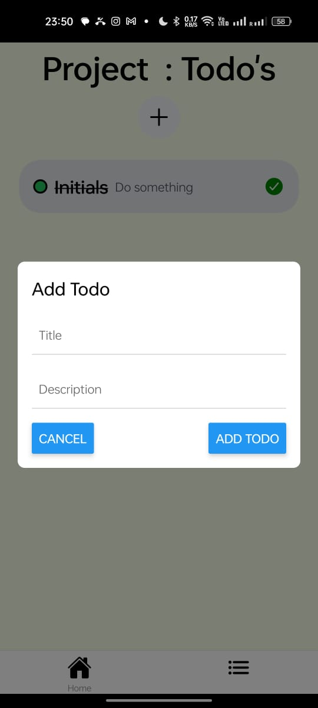
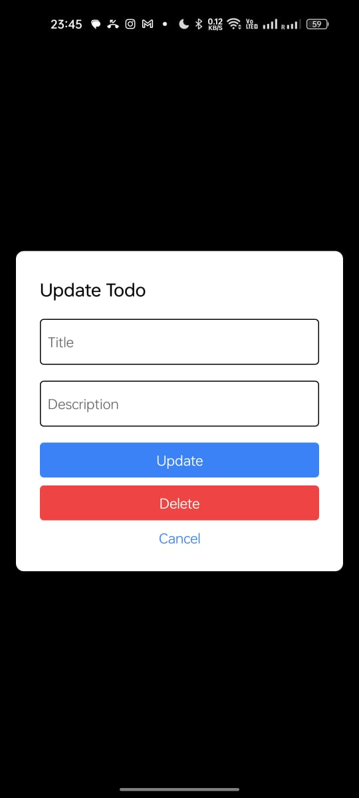

Sure! Here's a sample `README.md` file for your project that includes sections for what you’ve done, screenshots, and initialization instructions:

---

# TODO Application

A TODO application developed with React Native and SQLite for local data storage. This app allows users to manage their tasks efficiently with features like adding, updating, and deleting todos, and organizing them into groups.

## Features

- **Group Management:** Create and manage groups for organizing todos.
- **Todo Management:** Add, update, and delete todos within each group.
- **Completion Tracking:** Mark todos as completed or pending.
- **Modals:** Use modals for adding and updating todos.

## Screenshots

### Home Screen


### Todo List


### Add Todo Modal


### Update Todo Modal


File Structure
The project is structured as follows:
 ```sh
todo-application/
├── README.md
├── app
│   ├── (tabs)
│   │   ├── _layout.tsx
│   │   ├── index.tsx
│   │   └── todo-list.tsx
│   └── _layout.tsx
├── app.json
├── assets
│   ├── fonts
│   │   └── SpaceMono-Regular.ttf
│   └── images
│       ├── adaptive-icon.png
│       ├── favicon.png
│       ├── icon.png
│       ├── partial-react-logo.png
│       ├── react-logo.png
│       ├── react-logo@2x.png
│       ├── react-logo@3x.png
│       └── splash.png
├── babel.config.js
├── components
│   ├── add-group-modal.tsx
│   ├── add-todo-model.tsx
│   ├── navigation
│   │   └── TabBarIcon.tsx
│   ├── themed-view.tsx
│   ├── update-group-modal.tsx
│   └── update-todo-modal.tsx
├── constants
│   └── Colors.ts
├── expo-env.d.ts
├── hooks
│   ├── useColorScheme.ts
│   ├── useColorScheme.web.ts
│   ├── useDb.ts
│   └── useThemeColor.ts
├── nativewind-env.d.ts
├── package-lock.json
├── package.json
├── screenshots
│   ├── AddGroup.jpeg
│   ├── HomeScreen.jpeg
│   ├── TodoScreen.jpeg
│   ├── addtodo.jpeg
│   └── updateTodo.jpeg
├── scripts
│   └── reset-project.js
├── tailwind.config.js
└── tsconfig.json
```

## Getting Started

### Prerequisites

- **Node.js:** Ensure you have Node.js installed. [Download Node.js](https://nodejs.org/)
- **Expo CLI:** Install Expo CLI if you haven’t already.

  ```sh
  npm install -g expo-cli
  ```

- **SQLite:** SQLite is used for local data storage. Ensure you have it configured for your project.

### Installation

1. **Clone the Repository**

   ```sh
   git clone https://github.com/your-username/todo-application.git
   cd todo-application
   ```

2. **Install Dependencies**

   ```sh
   npm install
   ```


### Running the App

1. **Start the Expo Development Server**

   ```sh
   npm start
   ```

   This will open a new tab in your default browser with the Expo DevTools. You can scan the QR code with the Expo Go app to run the project on your mobile device, or use an emulator/simulator.

2. **Run on Android/iOS Emulator**

   To run the app on an Android or iOS emulator:

   ```sh
   npm run android
   ```

   or

   ```sh
   npm run ios
   ```

## Code Overview

### `index.tsx`

The main entry point of the application where the navigation and global components are set up.

### `components/`

- **`add-group-modal.tsx`**: Modal for adding new groups.
- **`add-todo-modal.tsx`**: Modal for adding new todos.
- **`update-todo-modal.tsx`**: Modal for updating existing todos.
- **`themed-view.tsx`**: A view component with theme support.

### `hooks/useDb.ts`

Contains database functions for interacting with the SQLite database:

- **`getGroups`**: Fetch all groups from the database.
- **`insertTodo`**: Insert a new todo into the database.
- **`deleteTodo`**: Delete a todo from the database.
- **`updateTodoToggle`**: Update the completion status of a todo.

### `(tabs)/`

- **`index.tsx`**: Home screen displaying the list of groups.
- **`todo-list.tsx`**: Screen displaying todos within a selected group.


---

This `README.md` provides a comprehensive overview of the application, its features, setup instructions, and code structure. Make sure to update the placeholders like `https://github.com/your-username/todo-application.git` with your actual repository URL and add the actual screenshots to the `screenshots` directory.
